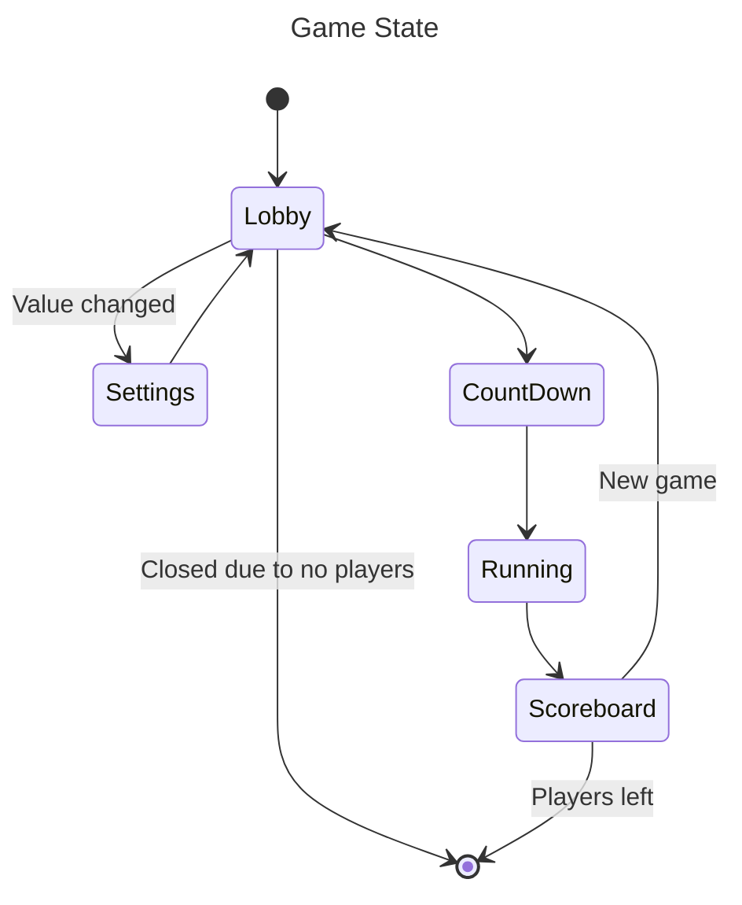

```mermaid

---
title: Game State
---

stateDiagram-v2
    [*] --> Lobby
    Lobby --> [*] : Closed due to no players
    Lobby --> Settings : Value changed
    Settings --> Lobby
    Lobby --> CountDown
    CountDown --> Running
    Running --> Scoreboard
    Scoreboard --> Lobby : New game
    Scoreboard --> [*] : Players left

```
